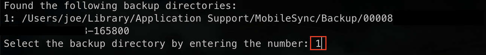

# Backup

- Easy to follow Python scripts for photo extraction (Only for iOS)

### How to use

- Git Clone on desktop

- Package install

    ```cli
    pip install pillow-heif pillow
    ```

- Open terminal (accessed `Full Disk Access` in Setting)

- Run

    

    For me, I only made backup file once, So enter `1`

    Code lists backup directory in order by number. Enter the number of the backup file you want (RED Square)
